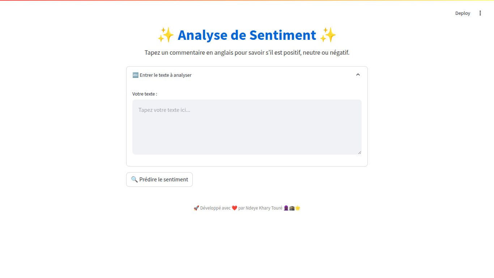
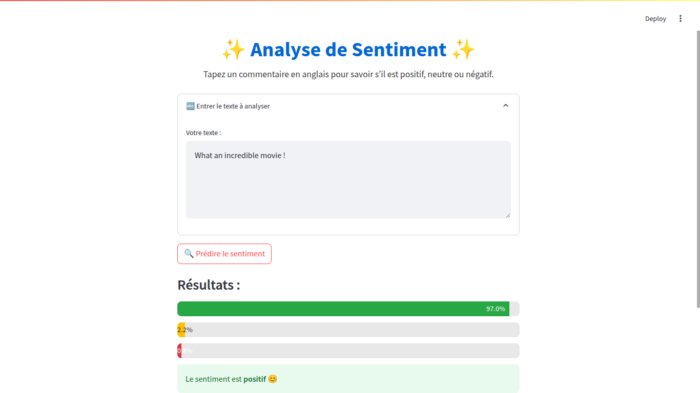

# Analyse de Sentiment avec le Modèle BERT

Ce projet propose une application web Streamlit pour l'analyse de sentiment à l'aide d'un modèle BERT pré-entraîné de la bibliothèque Hugging Face Transformers. Le modèle prédit le sentiment d'un texte donné comme étant positif, neutre ou négatif.

## Table des matières
- [Installation](#installation)
- [Utilisation](#utilisation)
- [Exemples de textes](#exemples-de-textes)
- [Captures d'écran](#captures-des-écrans)
- [Informations sur le dataset](#informations-sur-le-dataset)
- [Remerciements](#remerciements)

## Installation

Pour exécuter ce projet, vous devez avoir Python installé. Nous vous recommandons d'utiliser un environnement virtuel pour gérer les dépendances.

1. **Clonez le dépôt** :
    ```sh
    git clone <url-du-dépôt>
    cd <dossier-du-dépôt>
    ```

2. **Créez un environnement virtuel** :
    ```sh
    python -m venv env
    source env/bin/activate  # Sur Windows, utilisez `env\Scripts\activate`
    ```

3. **Installez les dépendances** :
    ```sh
    pip install -r requirements.txt
    ```

## Utilisation

1. **Exécutez l'application Streamlit** :
    ```sh
    streamlit run sentiment_analysis_app.py
    ```

2. **Accédez à l'application** :
    Ouvrez votre navigateur web et allez à `http://localhost:8501`.

3. **Saisissez un texte** :
    Entrez un texte dans la zone de saisie fournie et cliquez sur le bouton "Prédire le sentiment" pour obtenir la prédiction du sentiment.

## Exemples de textes

Utilisez les textes suivants pour tester l'analyse de sentiment :

1. **Sentiment positif** :
    - "I had a wonderful experience using this product. It exceeded all my expectations!"
    - "The customer service was outstanding, and the quality of the product is top-notch."
    - "I am extremely satisfied with my purchase. Highly recommended!"
    
2. **Sentiment négatif** :
    - "I had a wonderful experience using this product. It exceeded all my expectations!"
    - "The customer service was outstanding, and the quality of the product is top-notch."
    - "I am extremely satisfied with my purchase. Highly recommended!"
    
3. **Sentiment neutre** :
    - "The product is okay, but there are better alternatives available."
    - "It does the job, but I wouldn't go out of my way to recommend it."
    - "The experience was neither good nor bad, it was just average."

## Captures d'écran

### Page d'accueil


### Exemple de prédiction


## Informations sur le dataset

Le modèle utilisé dans ce projet (`distilbert/distilbert-base-uncased`) est pré-entraîné sur le dataset Tweet Sentiment Extraction. Le dataset Tweet Sentiment Extraction contient des phrases extraites de commentaires sur le réseau social X (anciennement Twitter), chaque phrase étant étiquetée comme sentiment positif, neutre ou négatif.

- **Source** : [Tweet Sentiment Extraction](https://www.kaggle.com/competitions/tweet-sentiment-extraction/data)
- **Tâche** : Classification multiclasse du sentiment (positif, neutre ou négatif)
- **Données** : Jeu de données de commentaires du réseau social X, anciennement Twitter
- **Labels** : Positif (2), Neutre (1) ou Négatif (0)

## Remerciements

- Ce projet utilise la bibliothèque [Transformers](https://github.com/huggingface/transformers) de Hugging Face.
- Le modèle pré-entraîné est fourni par [distilbert](https://huggingface.co/distilbert/distilbert-base-uncased).
- La bibliothèque Streamlit est utilisée pour créer l'application web.